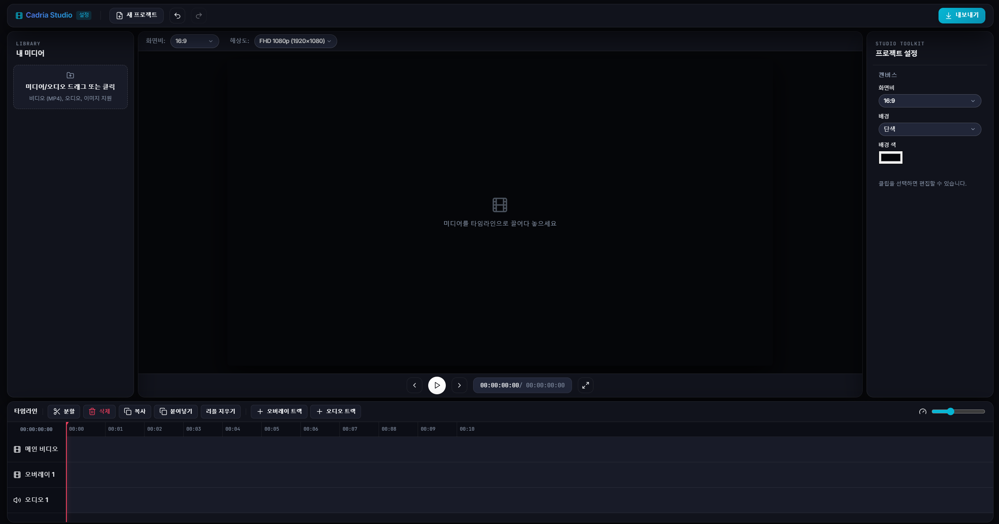
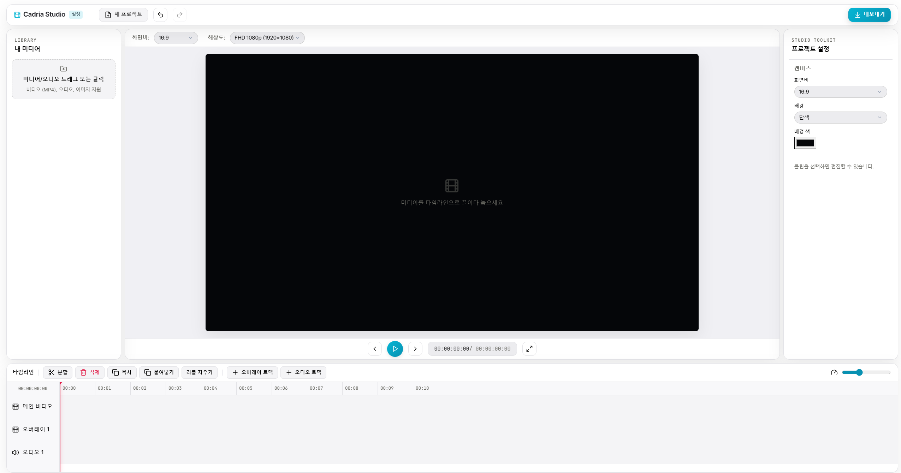
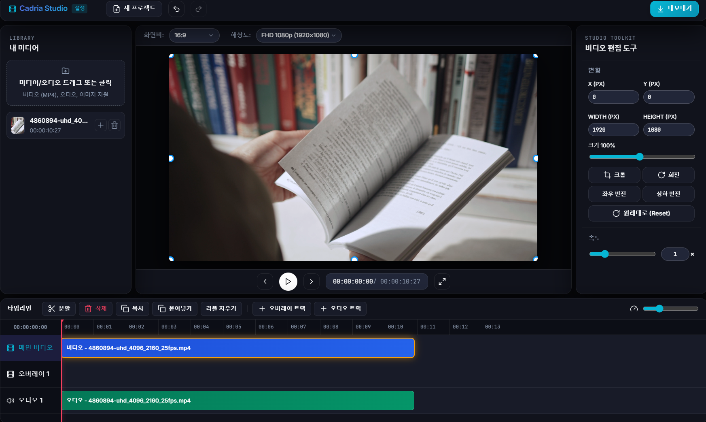

# 🎬 Cadria Studio

<p align="center">
  <b>웹 및 오프라인 데스크톱 환경을 지원하는 고성능 비디오 & 미디어 타임라인 편집기</b><br>
  React + TypeScript 코어와 Node.js + FFmpeg 백엔드 엔진으로 강력하고 정교한 편집 경험을 제공합니다.
</p>

<p align="center">
  
  
  
  
  
  
</p>

---

## 📸 미리보기 (Screenshots)

### 🌙 Dark Mode Interface
> 현대적이고 몰입감 높은 다크 모드 캔버스 및 멀티트랙 타임라인


### ☀️ Light Mode Interface
> 눈이 편안하고 깔끔한 Figma Editorial 스타일의 라이트 테마


### 📥 Media Library & Upload
> 비디오, 오디오 및 이미지 라이브러리 관리 및 드래그 앤 드롭 업로드


---

## ✨ 핵심 기능 (Features)

### 🎬 1. 정교한 타임라인 & 멀티트랙 편집
- **멀티트랙 구조**: 메인 비디오, 오버레이(PIP), 독립 오디오 트랙 지원
- **타임라인 조작**: 타임코드 스크러빙, 스케일 확대/축소, 클립 트림 및 시커(Seeker) 기준 분할
- **클립 편집**: 이동, 복사/붙여넣기, 삭제 및 트랙 간 리플(Ripple) 지우기
- **배속 조절**: 0.25x – 4.0x 정밀 배속 및 오디오 싱크 제어

### 🧲 2. 캔버스 리사이즈 & 비디오 자석 스냅 (Magnetic Snapping)
- **정교한 스냅**: 클립 간 모서리 및 중심축이 부드럽게 맞닿는 마그네틱 자석 스냅 가이드라인
- **자유로운 변환**: 캔버스 내 클립 크기 조절, 위치 이동, 회전, 좌우/상하 반전, 크롭(Crop)
- **화면 비율**: 16:9, 9:16, 1:1, 4:5, 4:3 해상도 프리셋 및 소스 기반 블러/그라디언트 배경 설정

### 🖼️ 3. 비디오 & 스틸 이미지 지원
- **이미지 지원**: JPG, PNG, WebP, GIF 등 스틸 이미지를 원하는 길이만큼 타임라인 클립으로 배치
- **미디어 탐색기**: 파일 드래그 앤 드롭 업로드 및 실시간 썸네일 미리보기

### ⚡ 4. FFmpeg 기반 고성능 렌더링 & 지정 파일명 다운로드
- **비동기 렌더링**: 진행률(%) 및 상태를 실시간 트래킹하며 렌더링 중 안전한 팝업 모달 제공
- **맞춤 다운로드**: 사용자가 지정한 내보내기 파일명 그대로 `.mp4` 파일 추출

---

## 🚀 시작하기 (Quick Start)

### 🐳 Docker Compose로 실행 (추천)

```bash
# 컨테이너 빌드 및 백그라운드 실행
docker compose -f docker-compose.node.yml up --build -d

# 실행 상태 및 로그 확인
docker compose -f docker-compose.node.yml ps
docker compose -f docker-compose.node.yml logs -f cadria
```

실행 후 브라우저에서 **`http://localhost:3080`** 접속

---

## 💻 데스크톱 앱 (Windows 64-bit)

Electron + NSIS 설치 파일로 배포합니다. FFmpeg는 빌드 때 받아 앱에 넣습니다.

```bash
node scripts/build_windows_installer.js
```

산출물: `desktop/release/Cadria_Studio_Setup_1.0.0.exe`

설치 마법사를 실행하면 시작 메뉴와 바탕화면 바로가기가 만들어집니다. 자세한 내용은 [`docs/desktop_build.md`](docs/desktop_build.md)를 참고하세요.

---

## 🛠️ 기술 스택 (Tech Stack)

| 구분 | 기술 스택 |
|---|---|
| **Frontend** | React 18, TypeScript, Zustand, Vanilla CSS, Vite |
| **Backend** | Node.js, Express, FFmpeg, FFprobe |
| **Desktop Shell** | Electron, electron-builder |
| **DevOps** | Docker, Docker Compose |

